# Implementación y evidencia del sistema

[Volver al README](../README.md)

## Alcance de la evaluación

La evaluación examina cuatro aspectos: dimensiones de los objetos de referencia, alineación de las vistas, relación entre nube y malla y topología. Este alcance corresponde al tercer objetivo del documento académico:

> Evaluar la precisión y la calidad geométrica del modelo tridimensional obtenido mediante la comparación dimensional con objetos poligonales de referencia y el análisis de indicadores de alineación multivista, fidelidad geométrica y topología.

Los otros objetivos abarcan la captura controlada y el desarrollo de la reconstrucción métrica. Se evalúa el comportamiento de la estrategia implementada, sin atribuirle superioridad frente a ICP libre u otros métodos.

## Geometría del montaje

La base tiene dimensiones aproximadas de 30 × 50 cm. Desde su borde frontal hasta el centro de la plataforma hay 40 cm; como las cámaras se sitúan unos 5 cm hacia el interior, la distancia longitudinal nominal entre estas y el centro es de unos 35 cm. La separación entre centros ópticos es aproximadamente 7,7 cm.

La calibración histórica registra 355,196 mm entre el punto medio estéreo y la recta del eje. Esta distancia tridimensional no equivale a la cota longitudinal nominal del esquema. El informe original conserva el prior de 400 mm y su tolerancia amplia; las nuevas calibraciones utilizan 350 mm por defecto en los pasos 08/09. Las calibraciones activas, las referencias congeladas y las mallas históricas mantienen sus valores originales.

## Interfaz y operación

Las imágenes muestran los controles reales en estado inicial, sin dispositivos conectados; las vistas oscuras no son capturas experimentales.

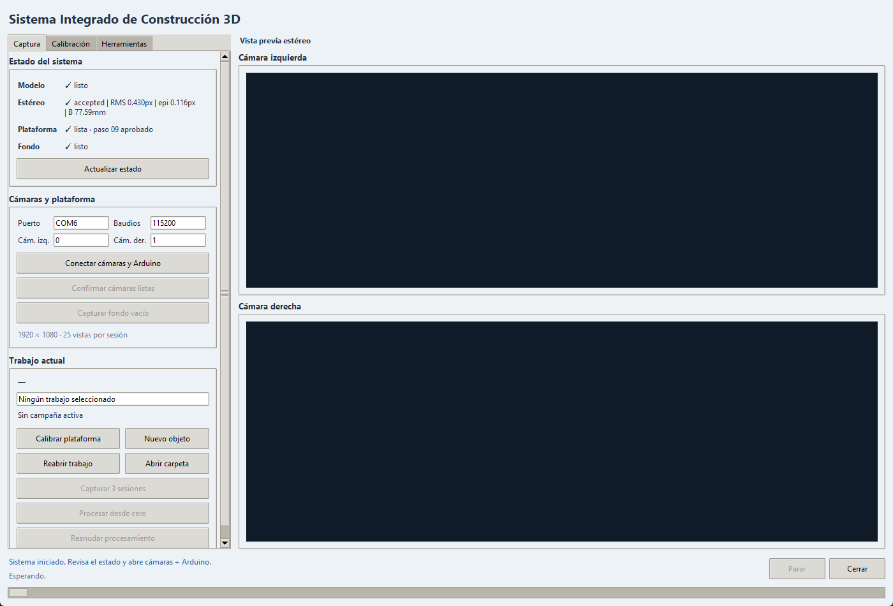

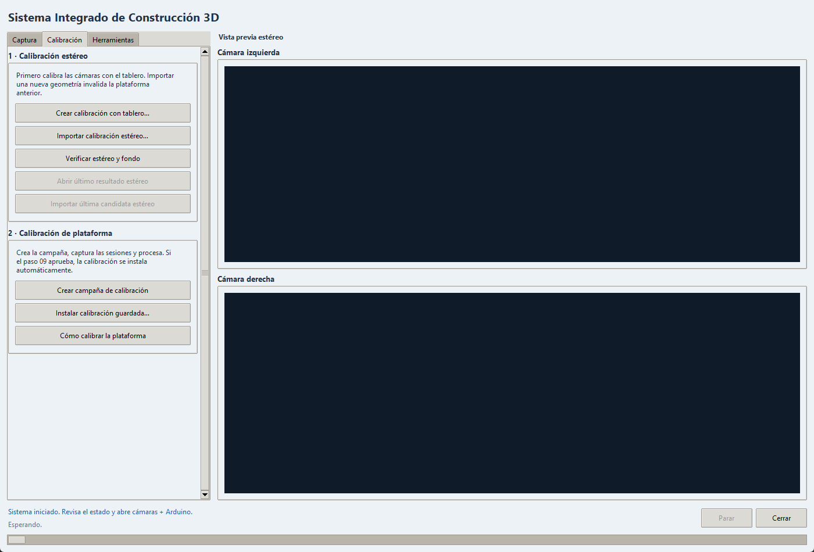

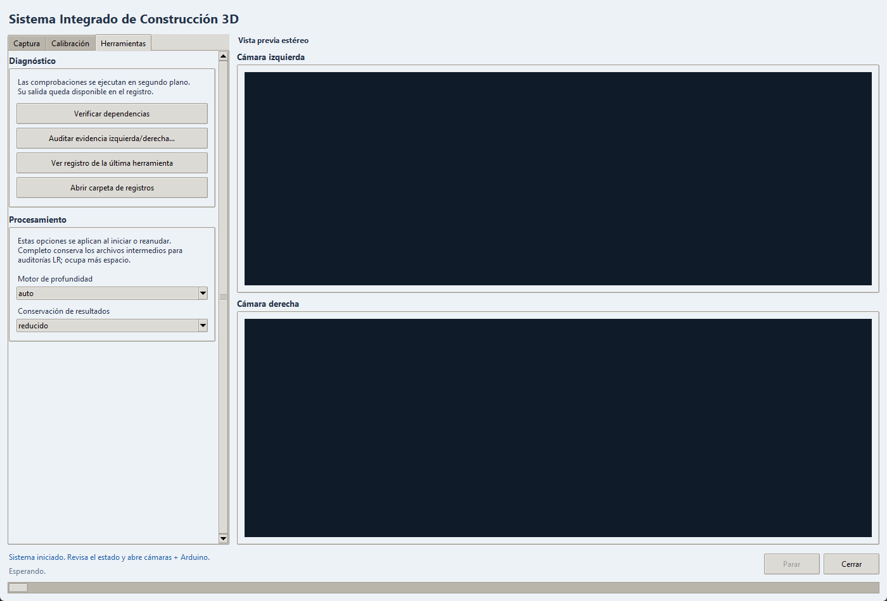

En **Captura** se conectan y confirman las cámaras, se registra el fondo vacío y se adquieren las tres sesiones de la campaña. **Calibración** permite crear, importar y verificar las referencias estéreo, además de preparar la campaña de plataforma. Los botones «Calibrar plataforma» y «Crear campaña de calibración» realizan esa misma preparación. **Herramientas** reúne el diagnóstico LR, la consulta de registros y la selección del motor de inferencia y del almacenamiento.

«Procesar desde cero» limpia los productos previos del trabajo. «Reanudar procesamiento» reutiliza checkpoints válidos y recalcula desde la primera etapa afectada. No equivale a continuar una captura interrumpida: la posición inicial debe restablecerse físicamente.

## Contratos de procesamiento

La [arquitectura y productos por etapa](arquitectura_y_codigo.md) identifica cada script.

| Grupo | Entradas | Operación y salidas | Control |
| --- | --- | --- | --- |
| 01–04 | Capturas, ONNX, estéreo, fondo | Mapa angular, profundidad, máscaras y selección | Correspondencia, LR, dominio y procedencia |
| 05–06 | Observaciones de igual pose | Consenso y nubes métricas con atributos | Acuerdo y respaldo de sesiones |
| 07–09 | Cubo de referencia | Geometría, eje, candidata y auditoría | Registro, cierre y contrato estéreo |
| 10 | Nubes y calibración | Registro y evidencia multivista | Alineación, cierre y refinamiento condicionado |
| 11–12 | Vistas registradas | Fusión y regularización | Soporte angular, confianza, conflicto y desplazamiento |
| 13–15 | Nube y candidatos | Superficie, topología y pulido | Fidelidad, cobertura, conectividad y controles locales |
| 16–18 | Malla y evidencia | Intersecciones, calidad y exportación | Estado, huella y unidades |

## Consenso y profundidad absoluta

En el paso 05, un ajuste bidimensional restringido alinea las imágenes y un medoide permite seleccionar una capa de profundidad compatible. Las observaciones se combinan después en profundidad inversa, según su confianza, residual y peso robusto. El resultado conserva la dispersión y la fiabilidad del consenso.

Las diferencias escalares de profundidad se registran como diagnóstico, con correcciones estimadas nulas. Se conserva así la profundidad absoluta, sin desplazarla para igualar las sesiones. La repetición de una pose aporta observaciones adicionales de esa posición; el soporte angular requiere poses distintas.

## Registro, fusión y superficie

El registro aplica la referencia de plataforma; el refinamiento transversal conserva dirección y ángulos y requiere controles independientes. La fusión pondera el soporte, la incidencia, la confianza, la dispersión y la coherencia local en un marco canónico cuyo eje Y se alinea con el eje de giro. Antes de comparar puntuaciones, el paso 13 comprueba la fidelidad, la cobertura y la conectividad de los candidatos. Si ninguno supera esos controles, la etapa se rechaza. La continuidad de la superficie puede incluir geometría estimada y, por sí sola, no acredita observación completa ni una geometría de referencia.

Los nueve informes conservan `runtime_axis_line_refinement_used = false`. Los cilindros 1 y 3 conservan Poisson; los otros siete resultados conservan paredes continuas con base abierta. El caso de cubo 1 seleccionó inicialmente Poisson y aceptó después el completado; su reporte identifica todas las caras finales como estimadas.

| Campaña | RMSE primario mediano (mm) | RMSE cierre punto–plano (mm) | Método final | Paso 13 interno (s) |
| --- | ---: | ---: | --- | ---: |
| cilindro1 | 0.307 | 0.365 | screened_poisson_adaptive | 119.0 |
| cilindro2 | 0.298 | 0.273 | continuous_walls_open_base | 104.0 |
| cilindro3 | 0.289 | 0.351 | screened_poisson_adaptive | 65.2 |
| cubo1 | 0.442 | 1.099 | continuous_walls_open_base | 316.2 |
| cubo2 | 0.361 | 0.491 | continuous_walls_open_base | 707.2 |
| cubo3 | 0.383 | 0.623 | continuous_walls_open_base | 367.1 |
| piramide1 | 0.625 | 0.518 | continuous_walls_open_base | 34.3 |
| piramide3 | 0.362 | 0.391 | continuous_walls_open_base | 31.2 |
| piramide4 | 0.369 | 0.289 | continuous_walls_open_base | 73.3 |

## Parámetros decisivos

| Grupo | Valor | Procedencia | Efecto |
| --- | --- | --- | --- |
| Estéreo | Tablero 6 por 8; cuadro 23 mm | Reporte disponible | Determina escala y geometría. |
| Montaje | 350 mm cámaras–eje nominal | Valor actual de pasos 08/09 | 40 cm desde borde menos 5 cm de retranqueo. |
| Consenso 05 | Acuerdo 6 mm; soporte mínimo 2 | Informe de cubo 1 | Selecciona profundidad compatible. |
| Fusión 11 | Vóxel 1.5 mm; poses independientes 2 | Informe de cubo 1 | Escala local y respaldo angular. |
| Regularización 12 | SOR: 24 vecinos y razón 2.5 | Informe de cubo 1 | Retirada de puntos aislados. |
| Superficie 13 | Cobertura mínima 0.90 | Selección registrada en cubo 1 | Admisibilidad interna de candidato. |
| Validación 17 | Radio de cobertura 3 mm | Informe histórico | Fracción de la nube próxima a malla. |
| Exportación 18 | Factor 0.001 y permutación de ejes | Código actual | Milímetros a metros para Blender. |

Los valores de cubo 1 describen esa campaña. Para consultar los valores declarados en el código, utilice la [referencia completa](referencia_parametros.md); los informes de cada ejecución identifican los valores efectivos.

## Calibración de plataforma registrada

Las 25 relaciones primarias superaron los controles. La mediana del RMSE punto–plano fue de 0,506 mm y la del P90, de 0,740 mm. En el cierre se registraron un solapamiento de 0,983, un RMSE robusto de 1,085 mm y un RMSE punto–plano de 0,776 mm. Estos indicadores describen el ajuste interno del cubo de referencia; no constituyen una certificación metrológica independiente.

## Montaje construido

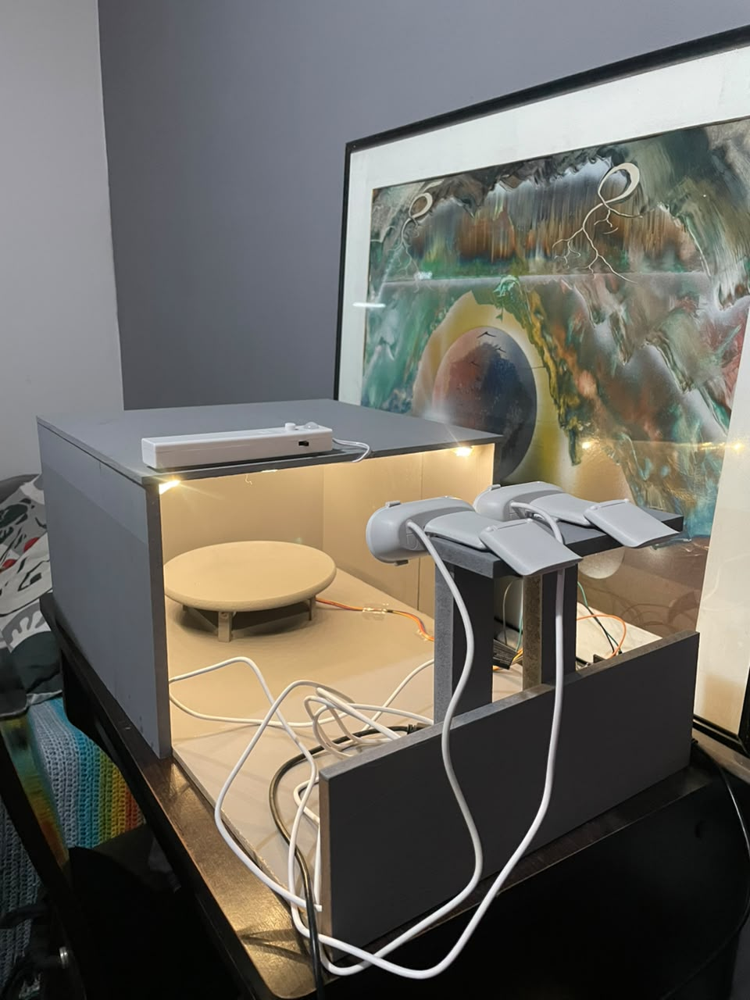

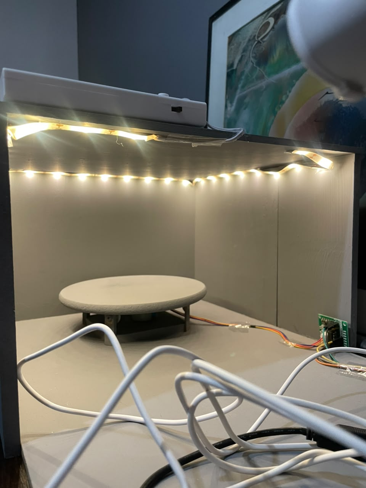

Las fotografías muestran el montaje construido. Las dimensiones proceden de las medidas documentadas, no de estimaciones sobre la perspectiva de las imágenes.

## Secuencia visual conservada de cubo 1

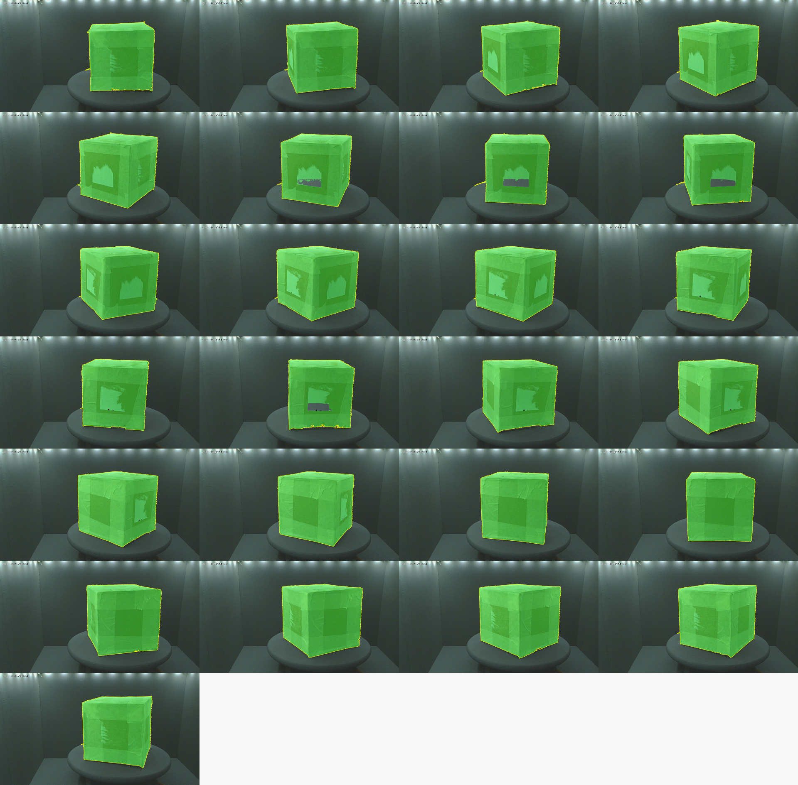

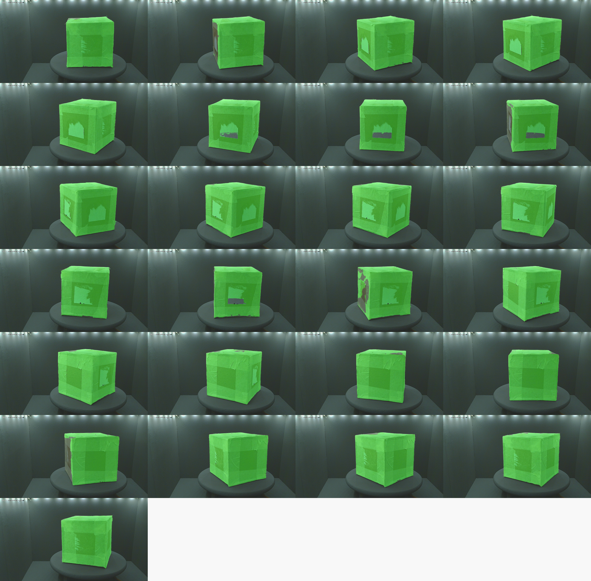

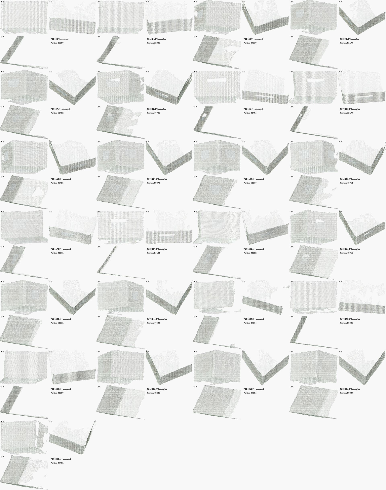

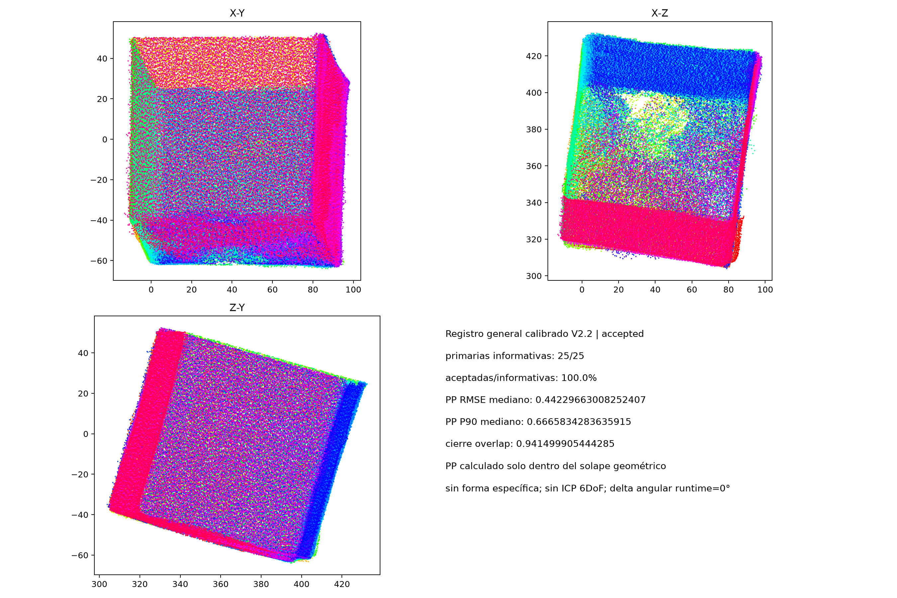

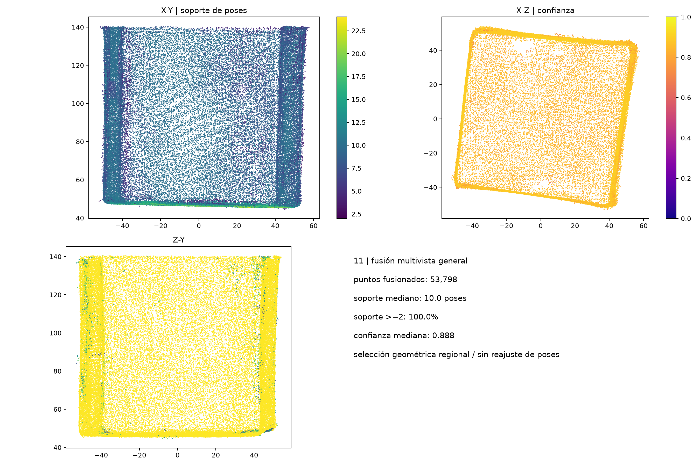

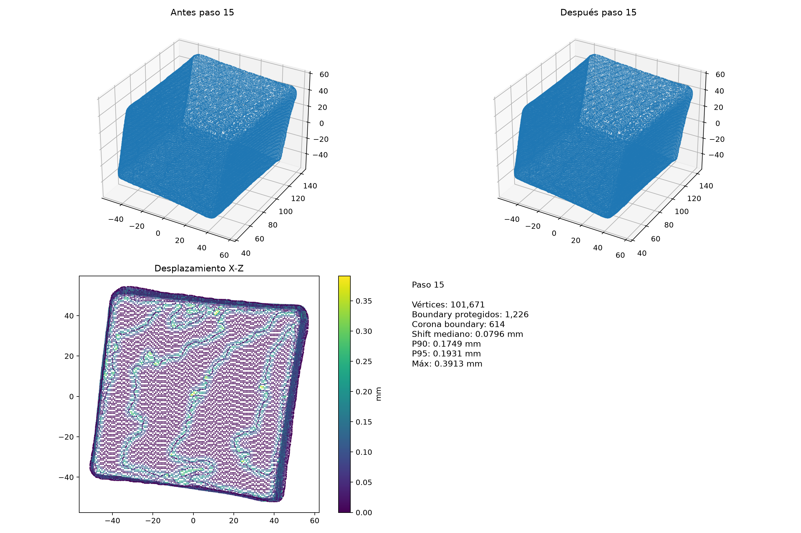

Los diagnósticos proceden de cubo 1. Las hojas de contacto reúnen varias poses y las vistas geométricas presentan resultados agregados. Los mapas individuales retirados durante la compactación no se regeneran para esta selección; los colores de la máscara validada tampoco representan una escala de distancia.

## Rendimiento histórico identificado

El registro `Piramide3_20260922_211146_20260923_104137.log` solicita reanudación, pero invalida desde 01 y ejecuta las 21 invocaciones de la ruta normal. Sus tiempos se corresponden con 21 archivos de telemetría cuyos procesos terminaron con código de salida cero. La suma externa de etapas es **4672,1 s (77,9 min)**, sin adquisición ni todos los intervalos entre procesos.

| Paso | Operación | Tiempo externo (s) |
| --- | --- | ---: |
| 01 | Mapa angular | 5.4 |
| 02 | Profundidad, tres sesiones | 575.7 |
| 03 | Máscaras, tres sesiones | 238.3 |
| 04 | Validación, tres sesiones | 1962.1 |
| 05 | Consenso | 42.8 |
| 06 | Nubes | 120.6 |
| 10 | Registro | 62.9 |
| 11 | Fusión | 923.5 |
| 12 | Regularización | 6.4 |
| 13 | Superficie | 33.1 |
| 14 | Topología | 118.8 |
| 15 | Pulido | 482.1 |
| 16 | Intersecciones | 62.1 |
| 17 | Validación final | 35.5 |
| 18 | Exportación | 2.8 |

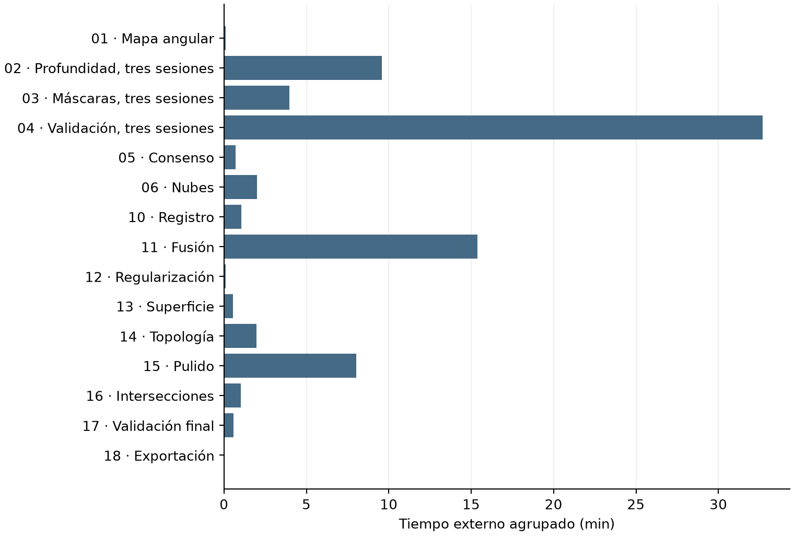

Los tiempos de las etapas 02–04 reúnen las tres sesiones. El muestreo de CPU, RAM disponible y GPU corresponde al equipo completo, por lo que no permite atribuir el consumo exclusivamente al proceso ni identificar el proveedor ONNX. Los tiempos internos de reconstrucción de superficie describen otro intervalo y se mantienen separados del registro externo.

## Procedencia y alcance de las fuentes

El [resumen de evidencia](evidencia_implementacion/resumen_implementacion.json) conserva indicadores extraídos, identificadores relativos y huellas SHA-256 de los originales. Las fuentes permanecen en las campañas locales, con sus métricas y mallas originales. El JSON incluye las 21 series de telemetría utilizadas y la suma de tiempos.

El proyecto desarrolla la adquisición, la calibración, las nubes, la estimación del eje, la integración y la evaluación planteadas inicialmente. Durante su desarrollo se incorporaron el consenso, la gestión de campañas, las referencias congeladas y la publicación de resultados. El presupuesto y el cronograma de planeación describen lo previsto, sin acreditar gastos finales ni fechas de ejecución. La evaluación publicada no incluye una comparación con estrategias alternativas.
