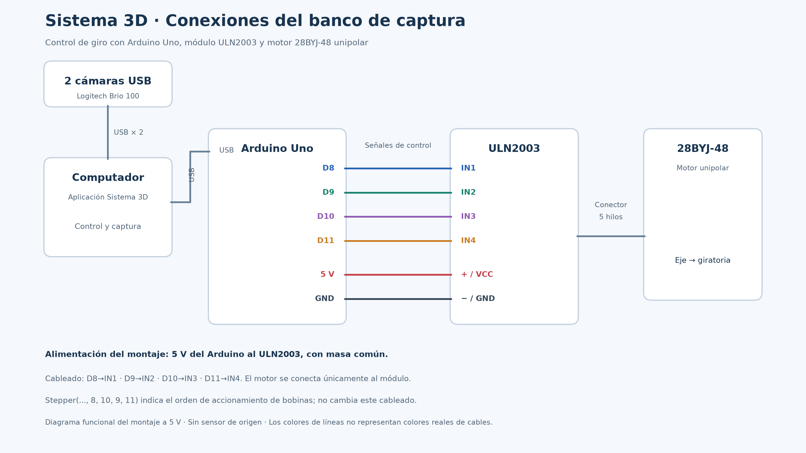

# Control de la plataforma

El [programa del Arduino Uno](control_plataforma_2055_pasos/control_plataforma_2055_pasos.ino) acciona un motor 28BYJ-48 unipolar mediante un módulo ULN2003. El computador se comunica con Arduino por USB a 115200 baudios; las dos cámaras tienen conexiones USB al computador.

[Diagrama vectorial SVG](imagenes/conexiones_plataforma.svg).

| Arduino Uno | ULN2003 |
| --- | --- |
| D8 | IN1 |
| D9 | IN2 |
| D10 | IN3 |
| D11 | IN4 |
| 5 V | + / VCC |
| GND | − / GND |

El conector de cinco hilos del motor se enchufa al conector de motor del módulo. La alimentación mostrada corresponde al montaje a 5 V desde Arduino, con masa común. El diagrama representa conexiones funcionales de los módulos: no asigna colores ni un orden de cables al conector del motor.

`Stepper(..., 8, 10, 9, 11)` establece el orden de accionamiento IN1, IN3, IN2, IN4. El cableado físico sigue la tabla, sin intercambiar IN2 e IN3. La biblioteca utiliza 2048 pasos para temporización; el recorrido calibrado es de 2055 pasos por vuelta. La secuencia de 25 movimientos es `[82, 82, 83, 82, 82]` repetida cinco veces.

La adquisición realiza 24 avances `NEXT`; `CLOSE` completa los 82 pasos restantes. `RESET` reinicia contadores sin mover la plataforma. No hay sensor de origen y `STOP` libera bobinas después del movimiento bloqueante en curso. Consulte el [manual de operación](../documentacion/instalacion_y_uso.md#plataforma-y-firmware) y la [recuperación de trabajos](../documentacion/operacion_y_cierre.md).
