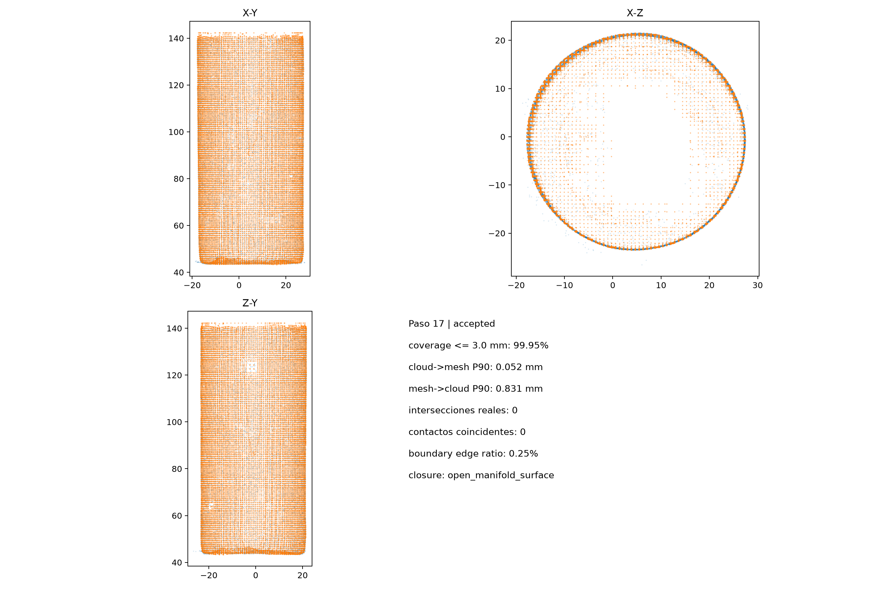

# Cilindro 3

Campaña: `cilindro3_20260919_132734`. Calidad interna: **accepted**.

La carpeta contiene la malla final en milímetros y su versión anterior al pulido, junto con un par de imágenes estéreo, las métricas del paso 17 y los informes de procedencia. Al comparar ambas versiones, tenga en cuenta que la anterior al pulido también puede incluir superficies estimadas en etapas previas.

## Advertencias del resultado

El informe no registra advertencias internas.

Consulte la [comparación dimensional exploratoria](../comparacion_dimensional.md) para revisar el método, sus limitaciones y las diferencias respecto a las [referencias aproximadas tomadas con regla](../medidas_fisicas.md). La calidad interna registrada describe los controles del procesamiento; la concordancia dimensional se examina mediante ese contraste físico.
