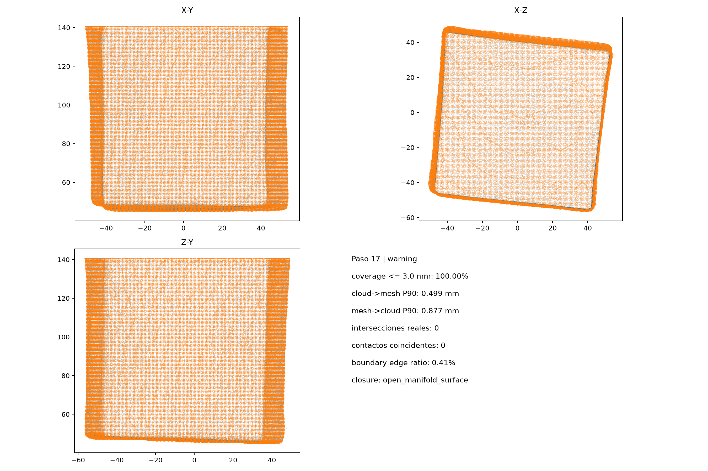

# Cubo2

Campaña: `cubo2_20260919_131206`. Calidad interna: **warning**.

Se incluyen el PLY final en milímetros, el PLY anterior al pulido, un par estéreo ilustrativo, las métricas del paso 17 y la procedencia. El modelo previo al pulido puede contener relleno de etapas anteriores: no equivale a una malla puramente observada.

## Advertencias del resultado

- Superficie completada por estimacion: el cierre no valida exactitud dimensional.

Consulte las [medidas físicas aproximadas con regla](../medidas_fisicas.md). Consulte la [comparación dimensional exploratoria](../comparacion_dimensional.md), con métodos y limitaciones explícitos. Accepted indica superar controles internos, no exactitud dimensional demostrada.
